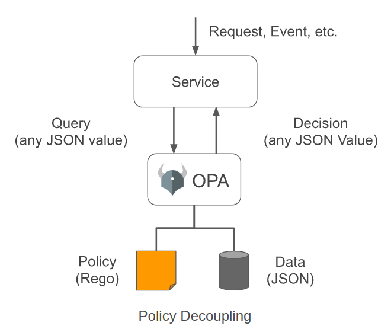

# Safe K8s Deployment using Gatekeeper & Open Policy Agent 

This demo shows how to enforce security policies for K8s deployments using [Open Policy Agent](https://www.openpolicyagent.org), 
and the corresponding [Gatekeeper](https://github.com/open-policy-agent/gatekeeper) project.

For details on the demo application see [hello spring boot application](../step1-hello-spring-boot).

## Open Policy Agent

Before diving into the Kubernetes part with [Gatekeeper](https://github.com/open-policy-agent/gatekeeper) 
let's look into [Open Policy Agent](https://www.openpolicyagent.org) how open policies work in general.

OPA decouples policy decision-making from policy enforcement. 
When your software needs to make policy decisions it queries OPA and supplies structured data (e.g., JSON) as input. 
OPA works similar to a BPM engine, or a state machine by decoupling processes from input and output data.



(Source: https://www.openpolicyagent.org)

Policies in OPA are written using OPA's own language called [Rego](https://www.openpolicyagent.org/docs/latest/policy-language).

```
package kubernetes.admission                                                

deny[msg] {                                                                 
  input.request.kind.kind == "Pod"                                          
  image := input.request.object.spec.containers[_].image                    
  not startswith(image, "myreg.com/")                                       
  msg := sprintf("image '%v' comes from untrusted registry", [image])       
}
```

This example checks if the container image to be deployed on a K8s cluster origins from 
a trusted container registry called (_myreg.com_).

To evaluate and play with [Rego](https://www.openpolicyagent.org/docs/latest/policy-language) you can use the [The Rego Playground](https://play.openpolicyagent.org)

## Gatekeeper

[Gatekeeper](https://github.com/open-policy-agent/gatekeeper) installs an [admission controller](https://kubernetes.io/docs/reference/access-authn-authz/admission-controllers/) on K8s that contains 
the [Open Policy Agent](https://www.openpolicyagent.org) to enforce policies for deployments on the Kubernetes cluster.


(Source: https://www.openpolicyagent.org)

To install [Gatekeeper](https://github.com/open-policy-agent/gatekeeper) just follow 
the [installation instructions](https://github.com/open-policy-agent/gatekeeper#deploying-a-release-using-prebuilt-image)
or use the script _deploy-gatekeeper.sh_ in this folder.

Rego policies cannot be deployed directly into a K8s cluster, instead [Gatekeeper](https://github.com/open-policy-agent/gatekeeper)
uses the [OPA Constraint Framework](https://github.com/open-policy-agent/frameworks/tree/master/constraint).

Here you first deploy a constraint template and then a corresponding constraint using the template.
In this step we will enforce that all Pod specifications require to include a _security context_ disallowing 
privilege escalation by setting _allowPrivilegeEscalation_ to _false_.

To enforce this, please execute the script _deploy-constraint.sh_ in this folder.
 
## Deploy the application (will be denied)

First we want to see the [Gatekeeper](https://github.com/open-policy-agent/gatekeeper) in action so that
our deployment is denied because of allowing privilege escalation.
The corresponding container image is pulled from [andifalk/hello-rootless-jib](https://cloud.docker.com/repository/registry-1.docker.io/andifalk/hello-rootless-jib) docker hub repository.

The application is deployed using the following deployment yaml file _k8s/deploy_denied.yaml_:

```yaml
apiVersion: apps/v1
kind: Deployment
metadata:
  labels:
    app: hello-opa-gatekeeper-denied
  name: hello-opa-gatekeeper-denied
spec:
  replicas: 1
  selector:
    matchLabels:
      app: hello-opa-gatekeeper-denied
  template:
    metadata:
      labels:
        app: hello-opa-gatekeeper-denied
    spec:
      automountServiceAccountToken: false
      securityContext:
        runAsNonRoot: true
      containers:
      - image: andifalk/hello-rootless-jib:latest
        name: hello-opa-gatekeeper-denied
        resources:
          limits:
            cpu: "1"
            memory: "512Mi"
          requests:
            cpu: "0.5"
            memory: "256Mi"
        securityContext:
          readOnlyRootFilesystem: true
          allowPrivilegeEscalation: true
          privileged: false
          runAsNonRoot: true
          capabilities:
            drop:
              - ALL
        readinessProbe:
          httpGet:
            path: /
            port: 8080
          initialDelaySeconds: 5
          periodSeconds: 5
        livenessProbe:
          httpGet:
            path: /actuator/health
            port: 8080
          initialDelaySeconds: 10
          periodSeconds: 5
        volumeMounts:
          - name: tmp-volume
            mountPath: /tmp
      restartPolicy: Always
      volumes:
        - name: tmp-volume
          emptyDir: {}
```

You will get an error message from the [Gatekeeper](https://github.com/open-policy-agent/gatekeeper)
denying the deployment.

```
admission webhook "validation.gatekeeper.sh" denied the request: [denied
      by psp-allow-privilege-escalation-container] Privilege escalation container
      is not allowed: hello-opa-gatekeeper-denied'
```

## Deploy the application (will be deployed successfully)

Now we want to see that [Gatekeeper](https://github.com/open-policy-agent/gatekeeper) accepts our
deployment because of disallowing privilege escalation now.
The corresponding container image is pulled from [andifalk/hello-rootless-jib](https://cloud.docker.com/repository/registry-1.docker.io/andifalk/hello-rootless-jib) docker hub repository.

The application is deployed using the following deployment yaml file _k8s/deploy.yaml_:

```yaml
apiVersion: apps/v1
kind: Deployment
metadata:
  labels:
    app: hello-opa-gatekeeper
  name: hello-opa-gatekeeper
spec:
  replicas: 1
  selector:
    matchLabels:
      app: hello-opa-gatekeeper
  template:
    metadata:
      labels:
        app: hello-opa-gatekeeper
    spec:
      automountServiceAccountToken: false
      securityContext:
        runAsNonRoot: true
      containers:
      - image: andifalk/hello-rootless-jib:latest
        name: hello-opa-gatekeeper
        resources:
          limits:
            cpu: "1"
            memory: "512Mi"
          requests:
            cpu: "0.5"
            memory: "256Mi"
        securityContext:
          readOnlyRootFilesystem: true
          allowPrivilegeEscalation: false
          privileged: false
          runAsNonRoot: true
          capabilities:
            drop:
              - ALL
        readinessProbe:
          httpGet:
            path: /
            port: 8080
          initialDelaySeconds: 5
          periodSeconds: 5
        livenessProbe:
          httpGet:
            path: /actuator/health
            port: 8080
          initialDelaySeconds: 10
          periodSeconds: 5
        volumeMounts:
          - name: tmp-volume
            mountPath: /tmp
      restartPolicy: Always
      volumes:
        - name: tmp-volume
          emptyDir: {}
```

This should now be deployed without any error.
